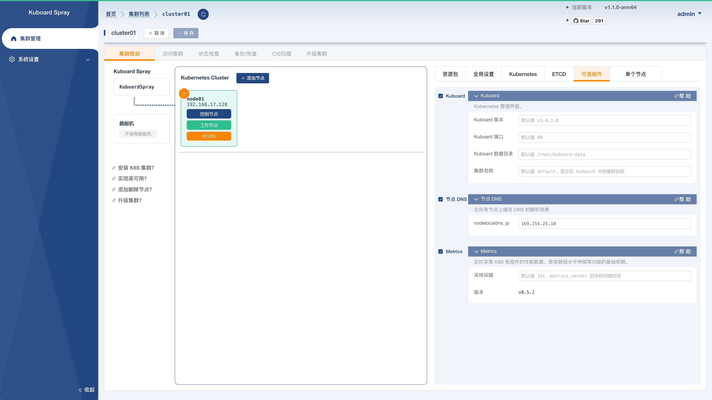
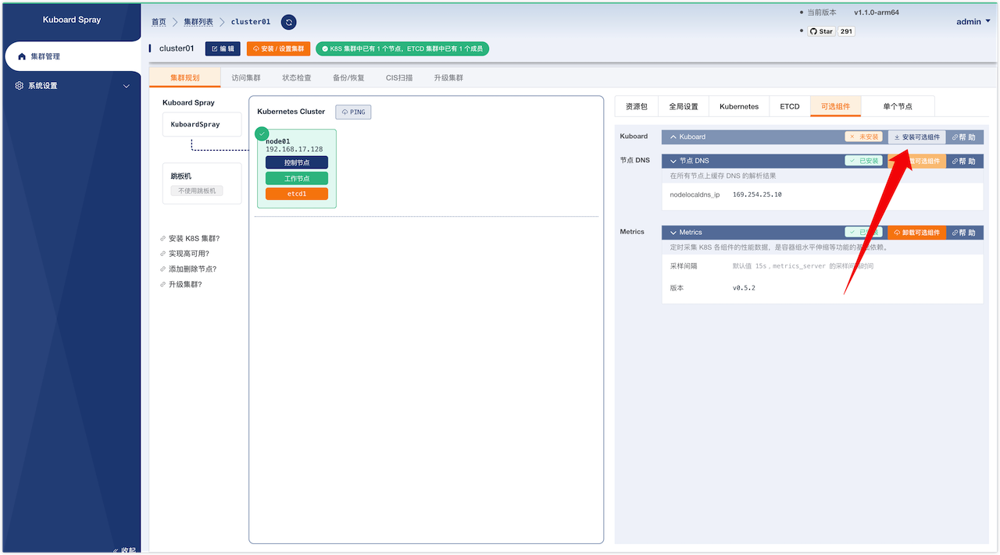
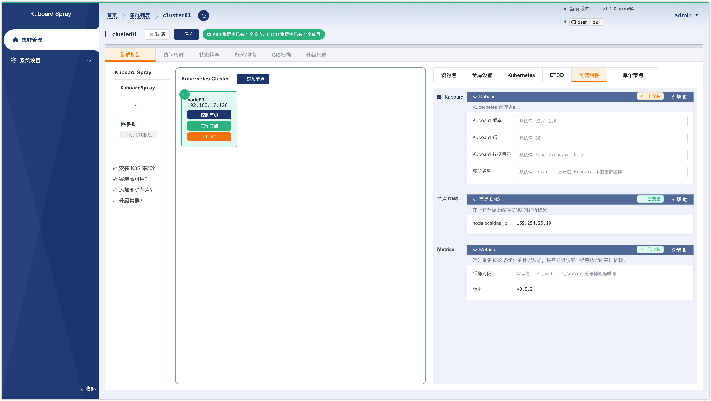
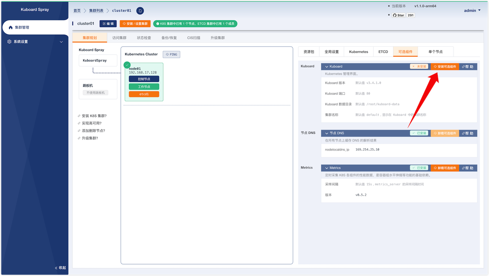
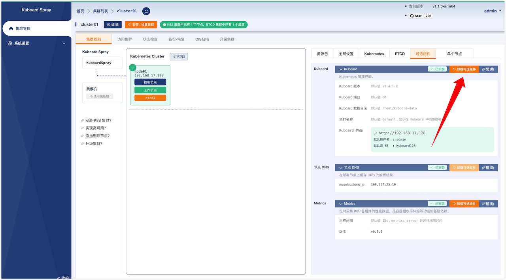

---
---

# 安装可选组件

KuboardSpray 支持一系列可选组件的自动化安装/卸载，例如：
* [Kuboard](./kuboard.md)
* [Node Local DNS](./nodelocaldns.md)
* [Netchecker](./netchecker.md)
* [Metrics Server](./metrics_server.md)

这些可选组件的安装和卸载遵循了相同的操作步骤，本文以可选组件 [Kuboard](./kuboard.md) 为例，描述了如何快速安装和卸载可选组件。

## 安装可选组件

您可以在如下两个时机安装可选组件：
* 安装集群时
* 安装集群后

下面是对这两个时机安装可选组件的过程分别做了阐述：

### 安装集群时选择可选组件

请参考文档 [离线安装 K8S](/guide/install-k8s.html) 使用 kuboardspray 执行集群安装，安装过程中，在集群规划的 `可选组件` 标签页，选中您想要安装的可选组件，或者去掉您不想要安装的可选组件，然后正常执行集群安装的过程即可。如下图所示：

### 安装集群后添加可选组件

如果您已经完成了集群的安装，可以后续再补充安装可选组件，步骤描述如下：

* 在集群详情页面，切换到 `可选组件` 标签，并且点击对应可选组件上的按钮 `安装可选组件`，如下图所示：

  

* 填写该可选组件所需要的参数，并点击 `保存` 按钮，如下图所示：

  

* 在集群详情页面，切换到 `可选组件` 标签，并且点击对应可选组件上的按钮 `安装可选组件`，在界面的提示下，可以完成该可选组件的安装。如下图所示：

  

## 卸载可选组件

在集群详情页面，切换到 `可选组件` 标签，并点击对应可选组件上的按钮 `卸载可选组件`，在界面的提示下，可以卸载该可选组件，如下图所示：

