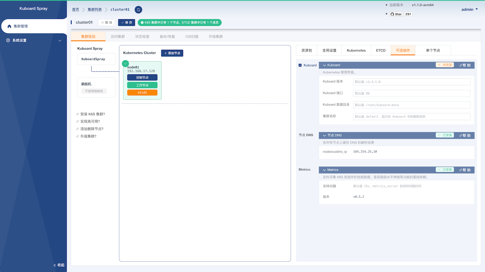

---
---

# Kuboard

Kuboard 是一款非常优秀的 Kubernetes 多集群管理工具，相关文档请参考 [https://kuboard.cn](https://kuboard.cn)。 kuboardspray 可以在 K8S 集群安装成功后快速安装 Kuboard。

<InstallAddon addonName="kuboard"/>

## Kuboard 安装参数

通过 kuboardspray 安装 kuboard 时，可以根据您的需要调整如下参数：

| 参数名称 | 默认值 | 参数描述 | 
|------|------|-------|
| | | |

如图所示：

