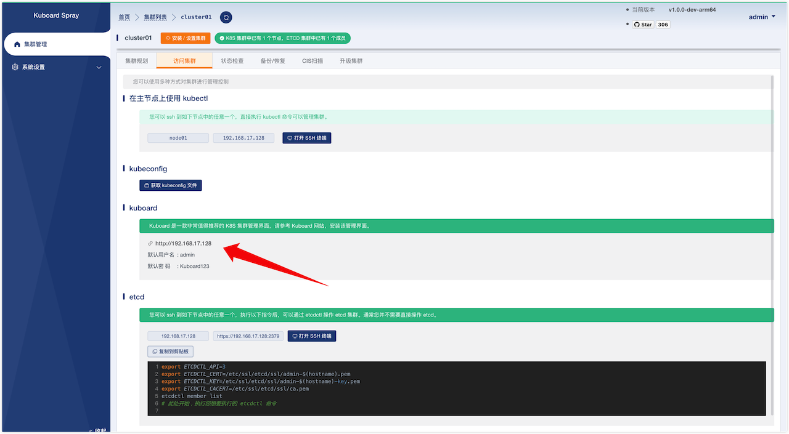

---
---

# Kuboard

Kuboard 是一款非常优秀的 Kubernetes 多集群管理工具，相关文档请参考 [https://kuboard.cn](https://kuboard.cn)。 kuboardspray 可以在 K8S 集群安装成功后快速安装 Kuboard。

<InstallAddon addonName="kuboard"/>

## Kuboard 安装参数

通过 kuboardspray 安装 kuboard 时，可以根据您的需要调整如下参数：

| 参数名称 | 默认值 | 参数描述 | 
|------|------|-------|
| Kuboard 版本| 资源包发布时最新的 kuboard 版本号 | 资源包中包含的 Kuboard 版本号，不建议修改此参数 |
| Kuboard 端口号 | `80` | Kuboard 的 Web 端口号 |
| Kuboard 数据目录 | `/root/kuboard-data` | Kuboard 的数据存储目录 |
| 集群名称 | `default` | 此集群在 Kuboard 中显示的名称 |

::: tip 注意
* KuboardSpray 会将 Kuboard 安装到第一个控制节点，并通过该节点的 80 端口发布；
* KuboardSpray 会默认将当前集群导入到 Kuboard 中。
:::

如图所示：

## 访问 Kuboard

完成 Kuboard 可选组件的安装之后，切换到 `访问集群` 标签页，可以找到 Kuboard 的访问方式，通常默认用户名为 `admin`，默认密码为 `Kuboard123`，访问地址为第一个控制节点的 80 端口（取决于安装时的参数），如下图所示：

