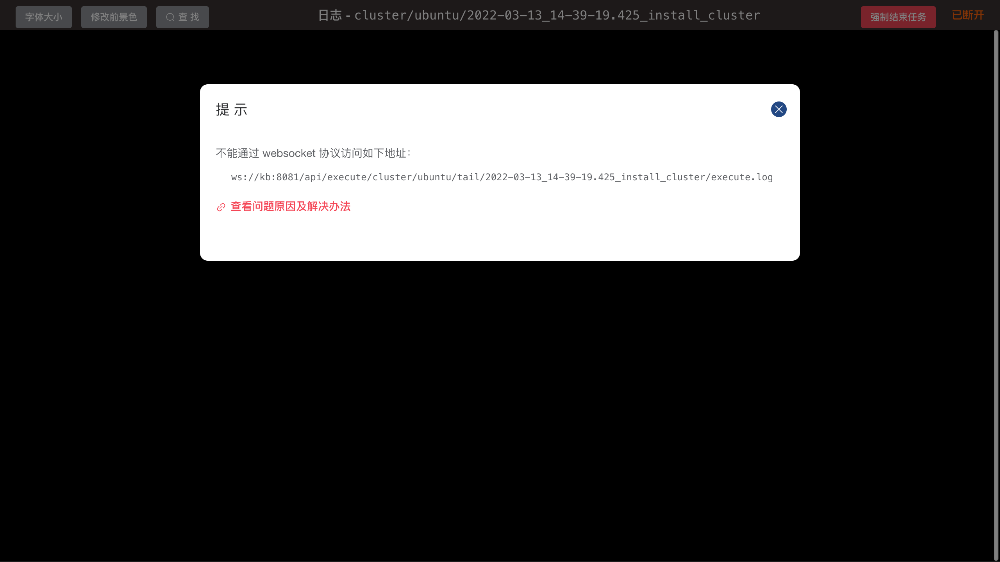

# WebSocket

当您进入这个页面时，通常是因为您已经在使用 kuboard-spray 时碰到了下面截图中的这个错误：



这个问题产生的最直接原因是因为浏览器不能使用 websocket 协议访问截图中的链接地址，而在 kuboard-spray 中，日志界面及 Web 终端界面都是依赖于 websocket 协议才能正常工作的。

具体到您的实际环境中，导致此问题的原因可能是如下几种当中的一种或多种：

* 您为 kuboard-spray 配置了反向代理，但未转发 websocket；
* 您所在的公司有上网行为管理软件，禁用了 websocket；
* 您使用深信服等防火墙为 kuboard-spray 做了端口映射，禁用了 websocket；
* 您的浏览器版本过低或浏览器限制使用 websocket。

本文后面的章节中，具体介绍了各种问题可能的解决办法。

::: tip 终极解决办法

如果您尝试了各种办法还解决不了，此问题的终极解决办法是：

* 在 kuboard-spray 所在的内网启动一个 windows 或带图形界面的 linux 服务器，并使用该机器上的浏览器直接访问 kuboard-spray。

:::

## 反向代理配置

如果您使用 nginx 作为反向代理，请参考下面的配置为 kuboard-spray 启用 websocket 转发：

```nginx{2,3,4,5,18,19}
http {
  map $http_upgrade $connection_upgrade {
      default upgrade;
      '' close;
  }

  server {
    listen       80; 
    # server_name  kuboard.this-is-a-sample.com; # 替换成你的域名

    location / {
      proxy_pass  http://10.99.0.8:25702/;  # 替换成你的 Kuboard IP 地址和端口
      client_max_body_size 10m;
      gzip on;

      proxy_http_version 1.1;
      proxy_pass_header Authorization;
      proxy_set_header Upgrade $http_upgrade;
      proxy_set_header Connection $connection_upgrade;
      proxy_set_header Host $host;
      proxy_set_header X-Real-IP $remote_addr;
      proxy_set_header X-Forwarded-For $proxy_add_x_forwarded_for;
      # proxy_set_header X-Forwarded-Proto https; # 如果您在反向代理上启用了 HTTPS
    }

  }
}
```

## 上网行为管理

请咨询贵公司的网管，是否部署了上网行为管理软件，并请网管修改策略，允许您访问界面截图中提示的 websocket 链接。

## 深信服防火墙

请咨询贵公司的网管，是否使用了深信服防火墙（或其他类似的防火墙），并请网管修改策略，允许您访问界面截图中提示的 websocket 链接。

## 浏览器版本

建议使用 chrome 浏览器的最新版本
