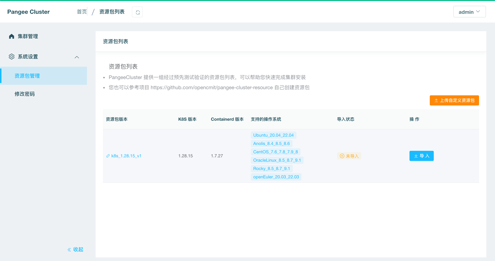
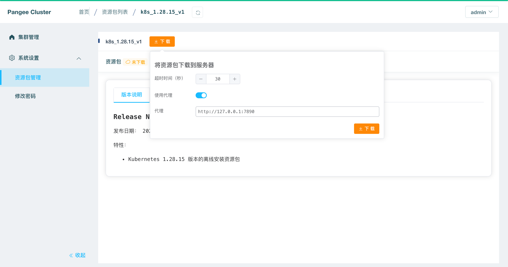
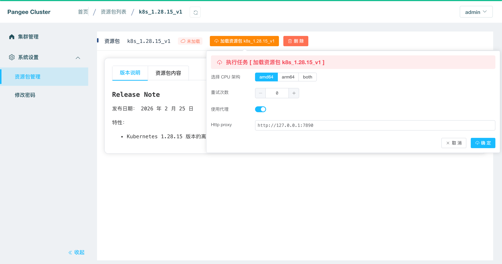
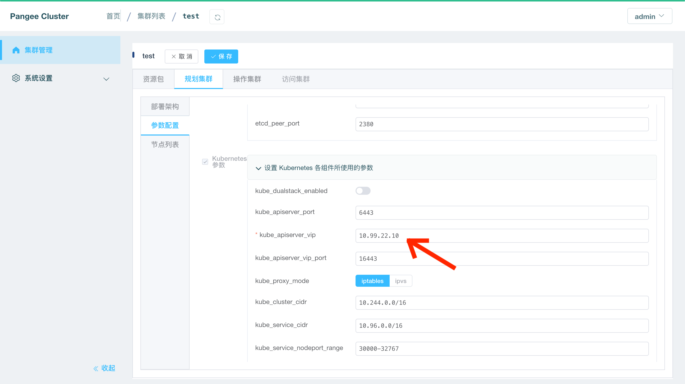
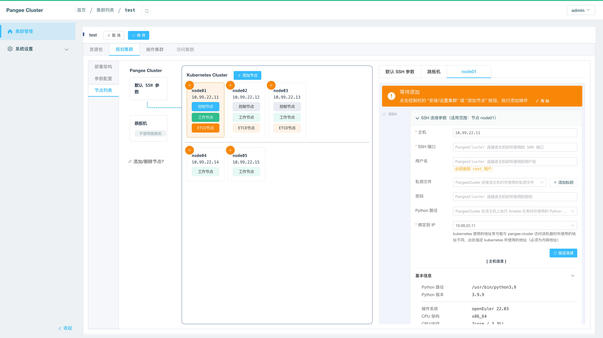
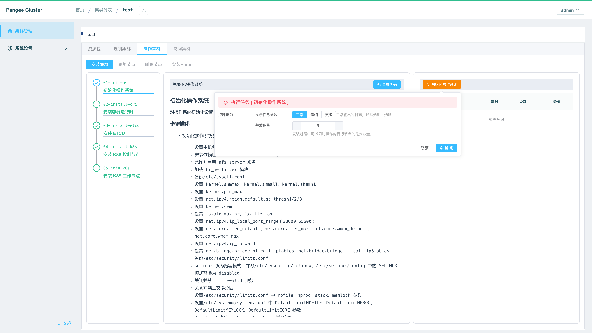
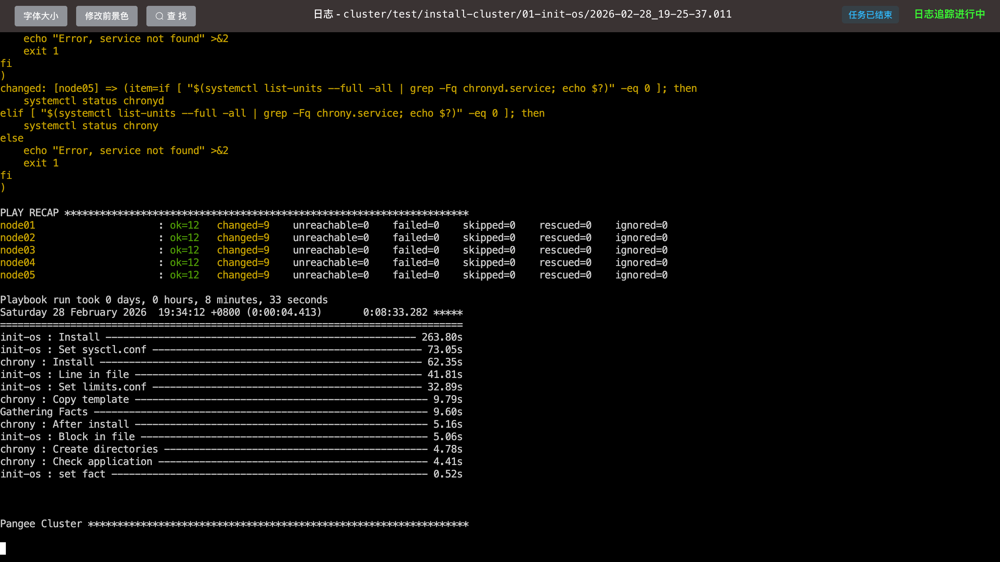
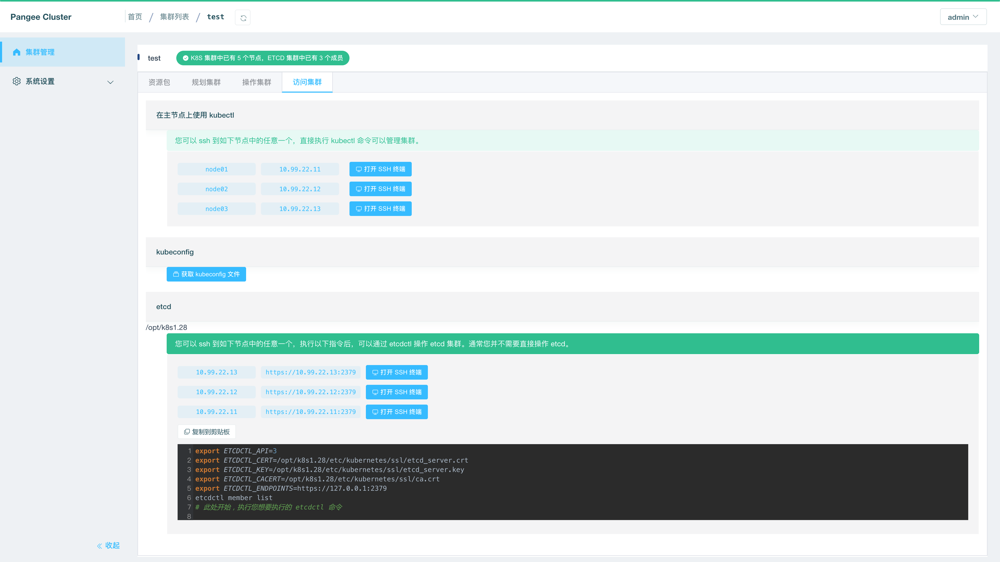

# 离线安装 K8S

## Pangee-Cluster

Pangee-Cluster 是一款可以在图形界面引导下完成 Kubernetes 高可用集群离线安装的工具，开源仓库的地址为 [Pangee-Cluster](https://github.com/opencmit/pangee-cluster)

**参考本文档完成安装后的集群版本为**

- Kubernetes v1.28.15 （与您使用的 [资源包版本](https://github.com/opencmit/pangee-cluster-resource-package/) 有关）

### 配置要求

对于 Kubernetes 初学者，在搭建 K8S 集群时，推荐使用如下服务器配置：

- 至少 2 台 **2 核 4G** 的服务器
- 支持的 CPU 架构 `arm64` / `amd64`

**操作系统兼容性**

操作系统的兼容性取决于 [资源包](https://github.com/opencmit/pangee-cluster-resource-package/)，最新资源包支持的操作系统有： openEuler、Anolis、Kylin Linux Advanced Server、Ubuntu、CentOS 等。

| 操作系统版本  | 本文档是否兼容                           | 备注   |
| ------------ | ---------------------------------------- | ------ |
| openEuler 20.03   | 😄 | 已验证 |
| openEuler 22.03   | 😄 | 已验证 |
| Ubuntu 20.04 | 😄 | 已验证 |
| Ubuntu 24.04 | 😄 | 已验证 |

## 安装 Pangee-Cluster

请参考文档 [快速安装 PangeeCluster](/index.html)

## 加载离线资源包

- 在 Pangee-Cluster 界面中，导航到 `系统设置` --> `资源包管理` 界面，可以看到已经等候您多时的 `Pangee-Cluster 离线资源包`，如下图所示：

  

- 点击 `导 入` 按钮，在界面的引导下完成资源包的加载。

  ::: tip 重要

  - 权限问题
    - 导入资源包时，可能会碰到 `no such file or directory` 或者 `permission denied` 之类的错误提示，通常是因为您开启了 SELinux，导致 pangee-cluster 不能读取映射到容器 `/data` 的路径
  - 离线导入
    - 如果您处在内网环境，上图中的列表默认将是空的，您可以按照如下步骤导入资源包：
      - 从 [Pangee-Cluster-Resource-Package](https://github.com/opencmit/pangee-cluster-resource-package/releases) 下载您需要的资源包，例如 `k8s_1.28.15_v1` 的 [Source code(zip)](https://github.com/opencmit/pangee-cluster-resource-package/archive/refs/tags/k8s_1.28.15_v1.zip)
      - 在 Pangee-Cluster 界面中，导航到 `系统设置` --> `资源包管理` 界面，点击界面中的 `上传自定义资源包` 按钮，按照界面的引导完成资源包的导入。

  :::

- 确认资源包导入成功后，您可以在 `资源包管理` 界面中看到导入的资源包，然后如下图所示：

  在该界面点击 `下载` 按钮，并输入有效的 http 代理服务器地址（ pangee-cluster 服务器将使用该代理从 [github.com](https://github.com/opencmit/pangee-cluster-resource-package/releases) 下载该版本的资源包到 `/data` 目录下），例如 `http://127.0.0.1:7890`，然后点击 `下载` 按钮。

  

- 确认资源包下载成功后，将显示如下界面：

  在该界面点击 `加载资源包 k8s_1.28.15_v1` 按钮，选择需要的 CPU 架构，并输入代理服务器地址（ pangee-cluster 服务器将使用该代理从 github.com / download.docker.com / registry.k8s.io / hub.docker.com / dl.k8s.io 等地址下载二进制安装程序或者容器镜像）

  

- 上述指令运行完成后，pangee-cluster 至此完成了对 k8s_1.28.15_v1 资源包的加载。

## 规划并安装集群

- 在 Pangee-Cluster 界面中，导航到 `集群管理` 界面，点击界面中的 `添加集群安装计划` 按钮，填写表单如下：

  - 集群名称： 自定义名称，本文中填写为 `test`，此名称保存后不可以修改；
  - 资源包：选择前面步骤中导入的离线资源包。

  

- 点击上图对话框中的 `确定` 按钮后，将进入集群规划页面，在该界面中切换到 `参数配置` 标签页，如下图所示：

  填写 `kube_api_server_vip` 字段，该 IP 地址应该与集群中的节点在相同网段，并且不被任何节点占用，本文中填写为 `10.99.22.10`。

  

添加您每个集群节点的连接参数并设置节点的角色，如下图所示：

  重要： pangee-cluster 所在机器不能当做 K8S 集群的一个节点，因为安装过程中会重启集群节点的容器引擎，这会导致 pangee-cluster 被重启掉。

  

  ::: tip 注意事项

  - 最少的节点数量是 1 个；
  - ETCD 节点的总数量必须为奇数；
  - 在 `默认 SSH 参数` 标签页，可以设置节点的通用连接参数，例如所有的节点都使用相同的 ssh 端口、用户名、密码，则共同的参数只在此处设置即可；
  - 如果您 PangeeCluster 所在节点不能直接访问到 Kubernetes 集群的节点，您可以设置跳板机参数，使 PangeeCluster 可以通过 ssh 访问集群节点。

  :::

- 点击上图的 `保存` 按钮，切换到 `操作集群` 标签页，按顺序执行 `安装集群` 的五个步骤，如下图所示：

  

- 每个任务执行成功后的界面如下图所示：

  

## 访问集群

:tada: :tada: :tada:

- 此时您已经完成了集群的安装，可切换到 `访问集群` 标签页，如下图所示：

  界面给出了三种方式可以访问 kubernetes 集群：
  

  - 在集群主节点上执行 kubectl 命令
  - 获取集群的 .kubeconfig 文件
  - 访问集群的 etcd 服务

  

  

