---

---

# 添加/删除节点

自 kuboard-spray v1.0.0-alpha.5 开始，支持集群节点的添加、删除。

## 工作节点

添加、删除工作节点时，对其他节点基本上没有影响，过程也相对比较简单。
### 添加工作节点

按照如下步骤，完成节点工作节点的添加：

* 进入集群规划页面的编辑模式，在界面中添加工作节点，并填写节点的连接参数，保存后，界面如下图所示：
  
  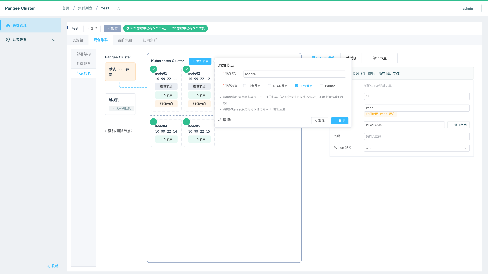

* 点击界面中 `1个节点待添加` 的按钮后，点击 `确定` 按钮，如下图所示：

  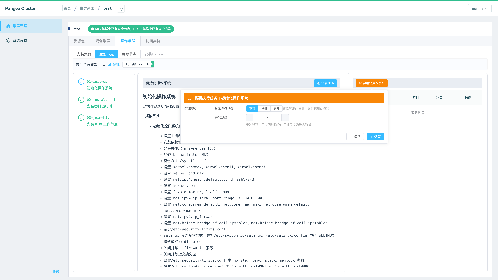

* 完成工作节点添加后，将在任务执行结束时提示节点添加成功，如下图所示：

  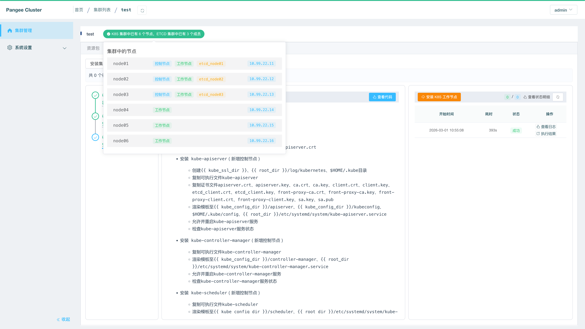

* 此时，您已经完成了工作节点的添加。

### 删除工作节点

* 进入集群规划页面的编辑模式，将想要删除的节点标记为待删除状态，保存后，界面如下图所示：
  
  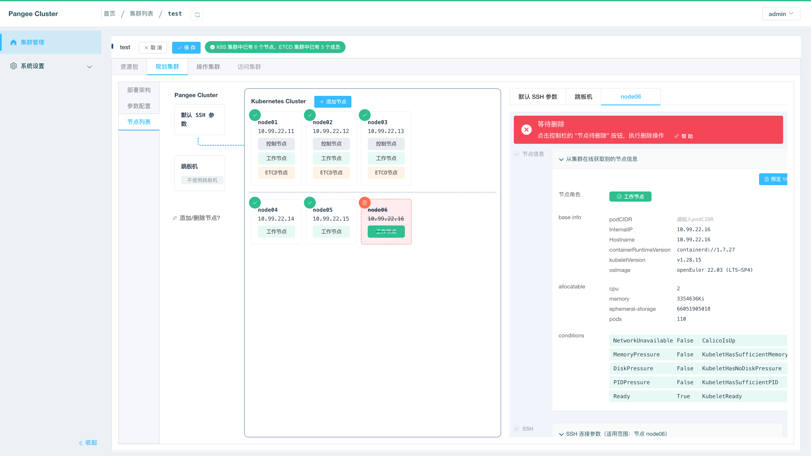

* 点击界面中 `1个节点待删除` 的按钮后，点击 `确定` 按钮，如下图所示：

  删除节点时，可选参数如下：
  
  |  参数名称   | 参数默认值  | 参数说明 |
  |  ----  | ----  |----|
  | 是否重置节点  | 重置节点 |  <li>重置节点：将执行 kubeadm reset 命令，并删除该节点上已经安装的二进制、容器镜像、容器引擎等；</li><li>不重置节点：有时候，节点已经出现故障，并且不能够通过 ssh 访问，此时必须选择 `不重置节点` 才能顺利将节点删除。</li> |
  | 待删除节点  | 空 |  请选择本次要删除的节点，您可以一次将多个节点标记为待删除，但是执行时只删除一个或者部分节点。 |
  | 允许删除未排空的节点  | 否 |  删除节点前 kuboard-spray 会尝试执行 kubectl drain 命令以排空节点，如果节点排空失败，是否允许继续删除该节点？ |
  | 应用停止等待时间  | 6 分钟 |  kubectl drain --grace-period 参数 |
  | 排空节点超时时间  | 10 分钟 |  kubectl drain --timeout 参数 |
  | 排空节点重试次数  | 3 |  kubectl drain 命令的重试次数 |
  | 两次排空尝试间隔  | 10 秒 |  kubectl drain 命令的重试间隔 |

  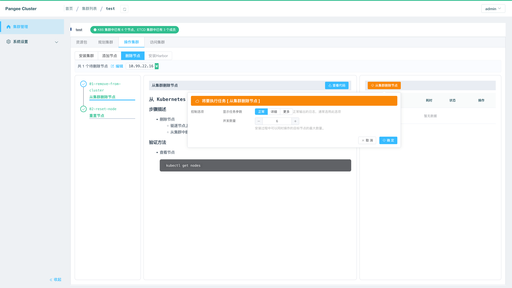

* 完成工作节点删除后，将在任务执行结束时提示节点删除成功，如下所示：

  > 此处省略截图。

  最终的提示信息如下：

  ``` sh
  KUBOARD SPRAY *****************************************************************


  [ 1 kube_nodes are already removed, please release the machine. ] 
  [ 1 个工作节点已从 Kubernetes 集群中删除，请释放该资源 ] 
  ```

* 此时，您已经完成了工作节点的删除。

## 控制节点

控制节点的添加和删除，将会影响到所有工作节点，因为每一个工作节点上的 kubelet / kube-proxy 等组件，都需要访问控制节点上的 kube-apiserver，在 kuboard-spray 中，通过 localhost 负载均衡的方式，使得工作节点上对 apiserver 的请求可以负载均衡地分发到多个控制节点实例。由于 localhost 负载均衡模式下，kube-apiserver 的列表被配置在每个工作节点的 `/etc/nginx/nginx.conf` 文件里，所以，在添加删除工作节点以后，需要更新并重新加载所有工作节点上 `/etc/nginx/nginx.conf` 文件。如下所示：

```nginx {5-7}
...
stream {
  upstream kube_apiserver {
    least_conn;
    server 10.99.2.11:6443;
    server 10.99.2.12:6443;
    server 10.99.2.13:6443;
    }

  server {
    listen        127.0.0.1:6443;
    proxy_pass    kube_apiserver;
    proxy_timeout 10m;
    proxy_connect_timeout 1s;
  }
}
...
```

添加控制节点、删除控制节点的步骤描述如下：

### 添加控制节点

* 进入集群规划页面的编辑模式，在界面中添加控制节点，并填写节点的连接参数，保存后，界面如下图所示：
  
  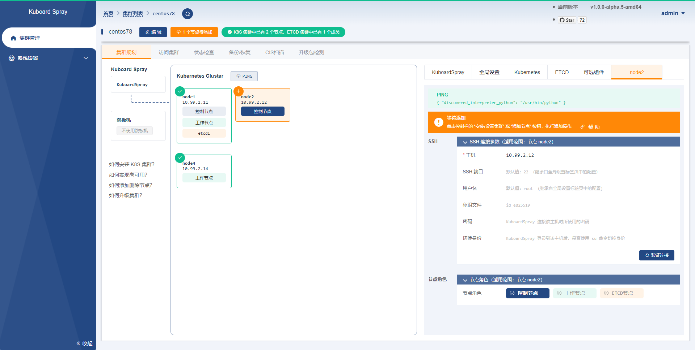

* 点击界面中 `1个节点待添加` 的按钮后，点击 `确定` 按钮：

  > 此处省略截图

* 完成控制节点添加后，将在任务执行结束时提示节点添加成功，如下图所示：

  > 请注意最后的红色提示内容，此时控制节点已经成功添加，但是需要您执行后续的 `更新负载均衡中 apiserver 列表` 的操作。

  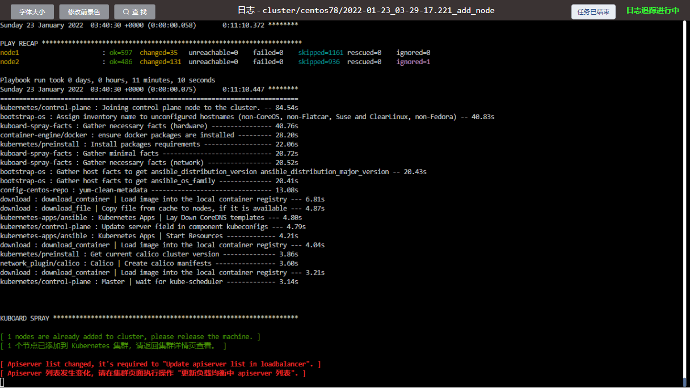

* 此时，返回集群规划页面，并点击 `更新负载均衡中 apsierver 列表` 的按钮，如下图所示：

  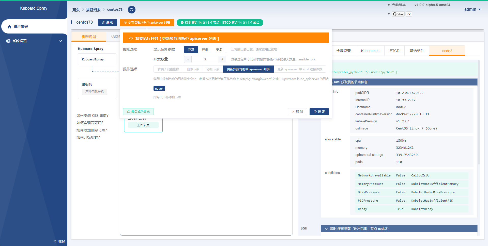

* 点击确定后，将执行更新动作，最终的结果如下所示：

  > 此处省略截图，最终提示信息如下所示：

  ``` sh
  KUBOARD SPRAY *****************************************************************

  [ Completed task "Update apiserver list in loadbalancer" ] 
  [ 已完成 "更新负载均衡中 apiserver 列表" 的任务，您可以继续其他操作。 ] 
  ```
  
* 此时您已经完成了控制节点的添加。

### 删除控制节点

* 进入集群规划页面的编辑模式，将想要删除的节点标记为待删除状态，保存后，界面如下图所示：
  
  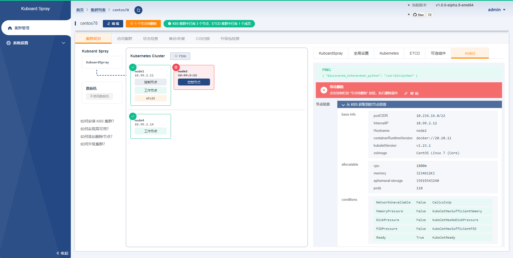

* 点击界面中 `1个节点待删除` 的按钮后，点击 `确定` 按钮，如下图所示：

  删除节点时，可选参数的描述请参考 [删除工作节点](#删除工作节点)

  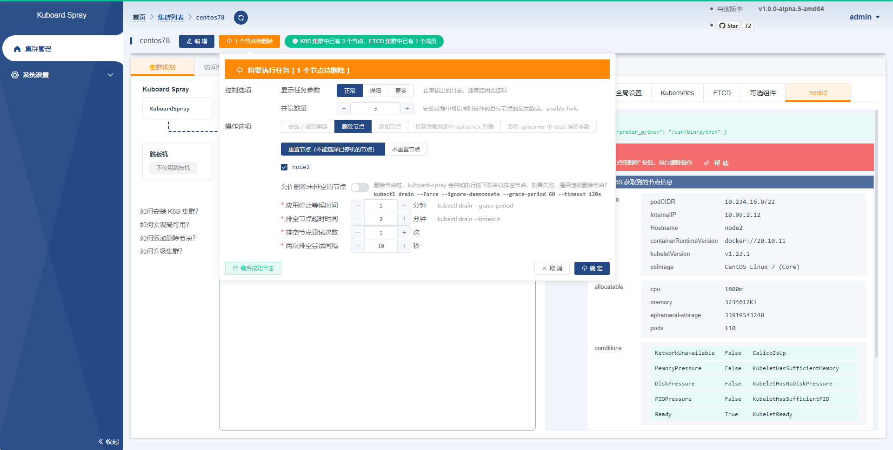

* 完成工作节点删除后，将在任务执行结束时提示节点删除成功，如下所示：

  > 请注意最后底的红色提示内容，此时控制节点已经成功删除，但是需要您执行后续的 `更新负载均衡中 apiserver 列表` 的操作。

  

* 返回到集群规划页面，点击 `更新负载均衡中 apsierver 列表` 的按钮，如下图所示：

  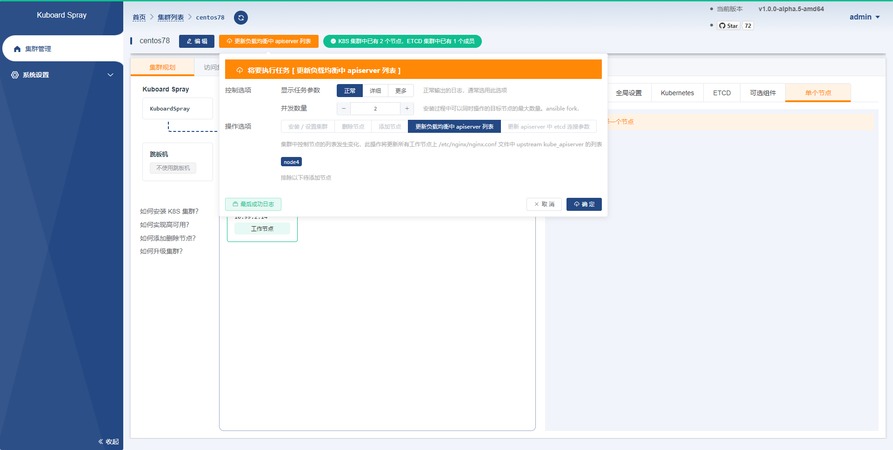

* 点击确定后，将执行更新动作，最终的结果如下所示：

  > 此处省略截图，最终提示信息如下所示：

  ``` sh
  KUBOARD SPRAY *****************************************************************

  [ Completed task "Update apiserver list in loadbalancer" ] 
  [ 已完成 "更新负载均衡中 apiserver 列表" 的任务，您可以继续其他操作。 ] 
  ```
  
* 此时您已经完成了控制节点的删除。

## ETCD节点

在 Kubernetes 集群中，每一个控制节点上的 `/etc/kubernetes/manifests/kube-apiserver.yaml` 文件中的 `--etcd-servers` 参数包含了所有 ETCD 节点的列表，在您执行 ETCD 节点的添加和删除时，该参数需要随之更新。如下所示：

``` yaml {17}
apiVersion: v1
kind: Pod
metadata:
...
  name: kube-apiserver
  namespace: kube-system
spec:
  containers:
  - command:
    - kube-apiserver
    - --advertise-address=10.99.2.11
    - --allow-privileged=true
...
    - --etcd-cafile=/etc/ssl/etcd/ssl/ca.pem
    - --etcd-certfile=/etc/ssl/etcd/ssl/node-node1.pem
    - --etcd-keyfile=/etc/ssl/etcd/ssl/node-node1-key.pem
    - --etcd-servers=https://10.99.2.11:2379,https://10.99.2.12:2379,https://10.99.2.13:2379
    - --event-ttl=1h0m0s
...
```

如果您使用 Kuboard Spray 安装和维护集群，则：
* 添加 ETCD 节点时，`kube-apiserver.yaml` 中的 `--etcd-servers` 参数将自动更新；
* 删除 ETCD 节点时，`kube-apiserver.yaml` 中的 `--etcd-servers` 参数需要您再执行一次操作才能完成更新。


下面的章节描述了如何使用 kuboard-spray 添加、删除 ETCD 节点。


### 添加 ETCD 节点

:::warning 重要

* 当前 kuboardspray 暂不支持部署独立的 etcd 节点，在添加 etcd 节点时，请同时将该节点设置为 `控制节点`；
* 添加 ETCD 节点时，ETCD 节点最终的数量应该为奇数个；

:::

请按照如下步骤向集群中添加 ETCD 节点：

* 进入集群规划页面的编辑模式，在界面中添加ETCD节点，并填写节点的连接参数，保存后，界面如下图所示：
  
  

* 点击界面中 `2个节点待添加` 的按钮后，点击 `确定` 按钮：

  > 此处省略截图

* 完成ETCD节点添加后，将在任务执行结束时提示节点添加成功，如下图所示：

  :::tip 重要

  * 添加 ETCD 节点成功后，kuboard-spray 会自动更新所有控制节点上的 /etc/kubernetes/manifests/kube-apiserver.yaml 文件中的 `--etcd-servers` 参数。

  :::

  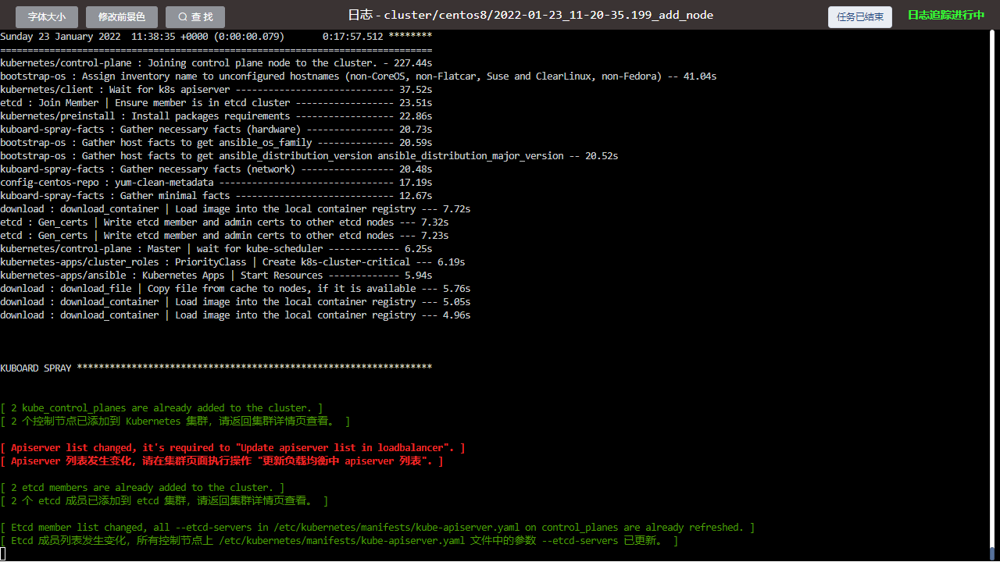

* 此时，返回集群规划页面，并点击 `更新负载均衡中 apsierver 列表` 的按钮，如下图所示：

  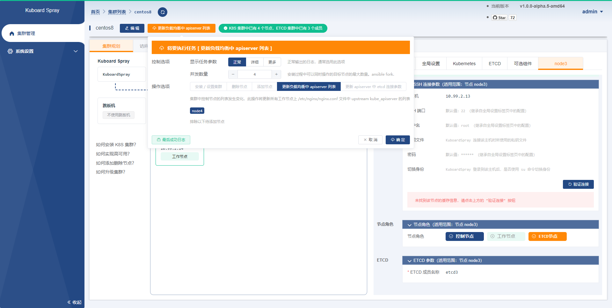

* 点击确定后，将执行更新动作，最终的结果如下所示：

  > 此处省略截图，最终提示信息如下所示：

  ``` sh
  KUBOARD SPRAY *****************************************************************

  [ Completed task "Update apiserver list in loadbalancer" ] 
  [ 已完成 "更新负载均衡中 apiserver 列表" 的任务，您可以继续其他操作。 ] 
  ```
  
* 此时您已经完成了ETCD节点的添加。

### 删除 ETCD 节点

请按照如下步骤删除集群中的 ETCD 节点：

* 进入集群规划页面的边际模式，在界面中将您想要删除的 ETCD 节点标记为待删除状态，保存后，界面如下图所示：

  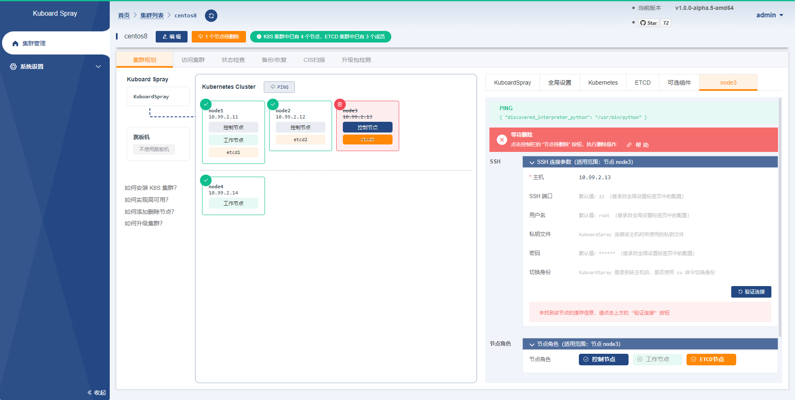

* 点击界面中 `1个节点待删除` 按钮，点击 `确定` 按钮，如下图所示：

  删除节点时，可选参数的描述请参考 [删除工作节点](#删除工作节点)

  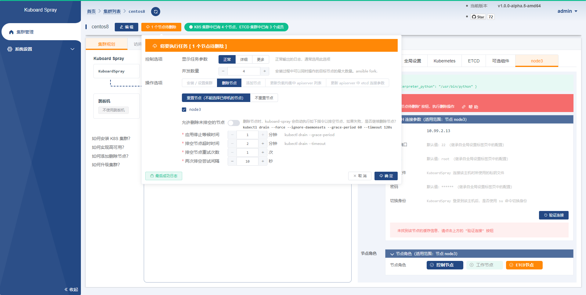

* 点击确定后，将执行更新动作，结果如下所示：

  :::tip 提示
  由于您删除的节点既是 etcd 节点，又是控制节点，因此 kuboard-spray 提示您：
  * 更新负载均衡中 apiserver 列表
  * 更新 apiserver 中 etcd 连接参数
  <p>
  如下图中的红色字体
  </p>
  :::

  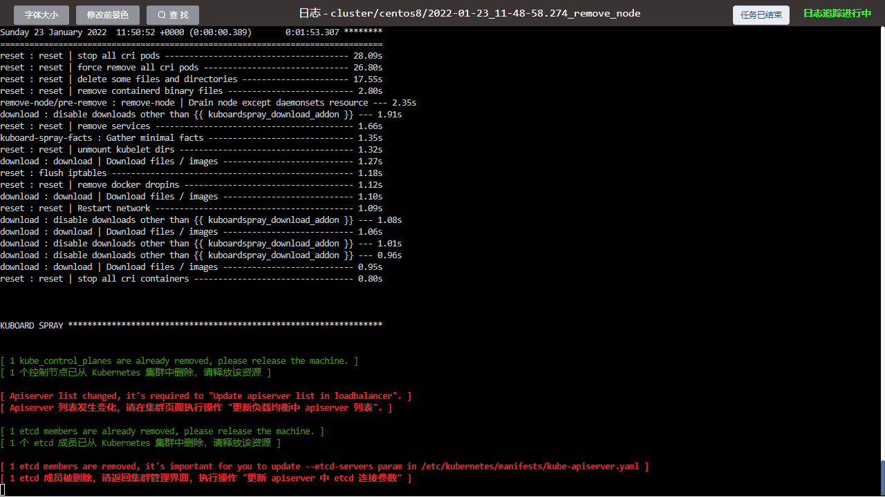

* 此时，返回集群规划页面，并点击 `更新 apiserver 中 etcd 连接参数`，如下图所示：

  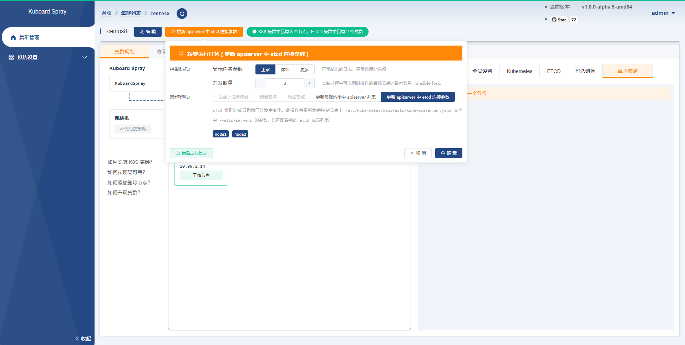

* 点击确定后，将执行更新动作，最终的结果如下所示：

  > 此处省略截图，最终提示信息如下所示：

  ``` sh
  KUBOARD SPRAY *****************************************************************

  [ Completed task "Update apiserver's --etcd-servers param". ] 
  [ 已完成 "更新 apiserver 中 etcd 连接参数"的任务，您可以继续其他操作。 ] 
  ```

* 再次返回集群规划页面，并点击 `更新负载均衡中 apsierver 列表` 的按钮，如下图所示：

  

* 点击确定后，将执行更新动作，最终的结果如下所示：

  > 此处省略截图，最终提示信息如下所示：

  ``` sh
  KUBOARD SPRAY *****************************************************************

  [ Completed task "Update apiserver list in loadbalancer" ] 
  [ 已完成 "更新负载均衡中 apiserver 列表" 的任务，您可以继续其他操作。 ] 
  ```
  
* 此时您已经完成了ETCD节点的删除。