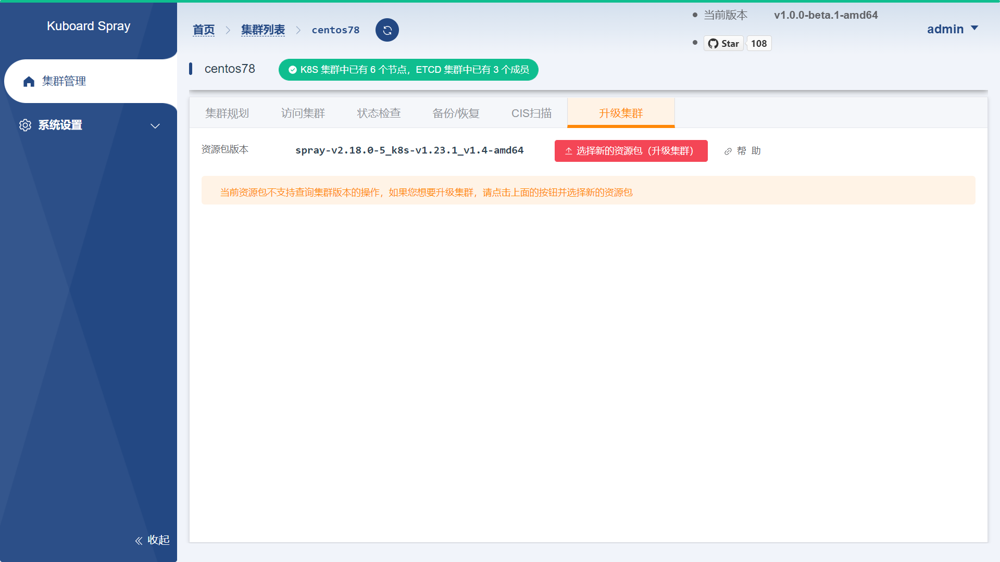
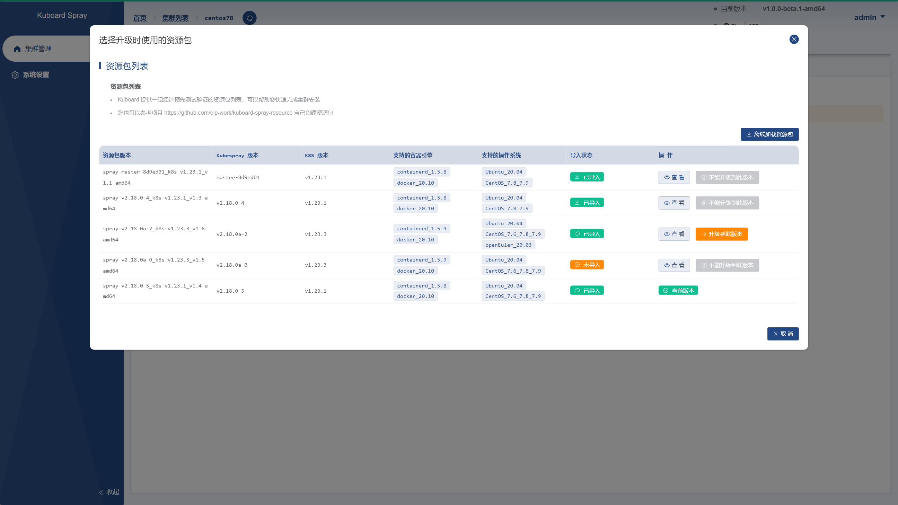
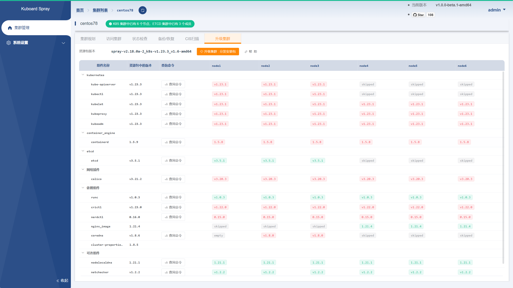
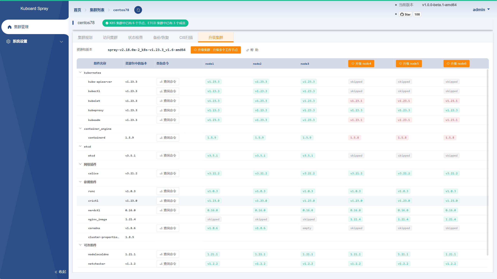
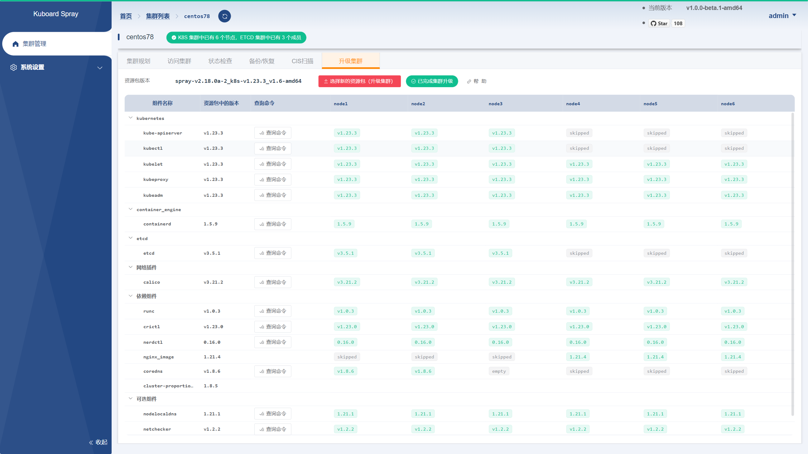

---
---

# 升级集群

## 前提条件

* KuboardSpray 版本不低于 `v1.0.0-beta.1`
* 假设您已经完成了一个集群的安装，例如，本例中：
  * 使用 `KuboardSpray v1.0.0-alpha.4-amd64` 以及 KuboardSpray 资源包 `spray-v2.18.0-5_k8s-v1.23.1_v1.4-amd64` 安装了集群 v1.23.1，其中包含6个节点（3个主节点、3个工作节点）
  * 完成安装后，将 KuboardSpray [升级](/support/change-log/v1.md) 到 `v1.0.0-beta.1`

按照下面的步骤，可以完成对 Kubernetes 集群的升级：
* 切换到新版资源包
* 分发安装包到节点
* 升级主节点
* 升级工作节点

## 切换到新版资源包

* 在集群详情页面，切换到 `升级集群` 标签页，如下图所示
  

* 点击上图界面中的 `选择新的资源包（升级集群)` 按钮，如下图所示：
  
  > 在此页面中可以 `查看` 目标资源包与当前已安装资源包的差异对比；

  

* 点击上图界面中的 `升级到此版本` 按钮，如下图所示：

  > 此时将显示各个节点上，已安装组件的版本与目标资源包版本之间的对比（也代表着集群升级的进度）

  

## 分发安装包到节点

* 点击上图界面种的 `升级集群：分发安装包` 按钮，然后点击确定，KuboardSpray 会将新版本的安装包分发到各个节点。

  升级前分发安装包的原因主要有：
  * Kubernetes 中，部分组件以 DaemonSet 的形式存在，例如 `kube-proxy`、`calico-node` 等。如果不提前分发安装包，在升级过程中，修改 DaemonSet 中镜像版本之后，将导致没有安装包的节点在一定时间内缺失这些组件。

  > 此处省略截图

## 升级主节点

* 完成 **分发安装包到节点** 的步骤以后，点击 `升级集群：升级控制节点和 ETCD 节点` 按钮，然后点击确定，KuboardSpray 会逐个升级主节点。

  > 此处省略截图

* 完成 **升级主节点** 的步骤以后，界面显示如下所示：

  > 您可以查看到哪些节点已经完成了升级，哪些节点还未完成升级。

  

## 升级工作节点

* 点击 `升级集群：升级多个节点` 或者 `升级节点：node4` 按钮，然后点击确定，KuboardSpray 会完成工作节点的升级。

  最终完成升级的状态如下图所示：

  