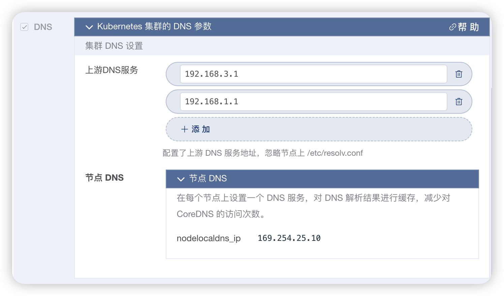

# DNS

> kuboard-spray 的版本不低于 `v1.2.3`。

使用 kuboard-spray 安装 Kubernetes 集群时，可以定义：
* 上游 DNS 服务器地址
* 节点 DNS 缓存

如下图所示：

  

## 上游DNS服务

* 可以指定多个上游DNS服务器地址，当您在容器组内查找 kubernetes 集群以外的域名时，CoreDNS 会将域名查找请求转发到指定的上游 DNS 服务器地址（可以配置多个）。

## 节点DNS

节点 DNS 将会在每一个节点上部署一个 nodelocaldns [NodeLocal DNS Cache](https://github.com/kubernetes/enhancements/blob/master/keps/sig-network/1024-nodelocal-cache-dns/README.md) 作为 CoreDNS 的缓存，以缓解对 CoreDNS 服务的压力。

nodelocaldns_ip ： 节点 DNS 服务的虚拟 IP 地址，默认为 `169.254.25.10`，节点上所有向此地址发起的请求都将被转发到该节点上的 nodelocaldns 容器组实例。