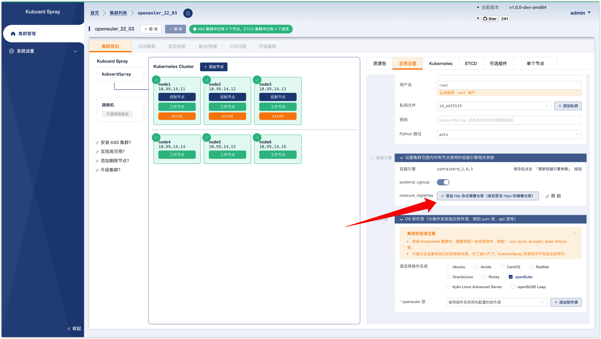
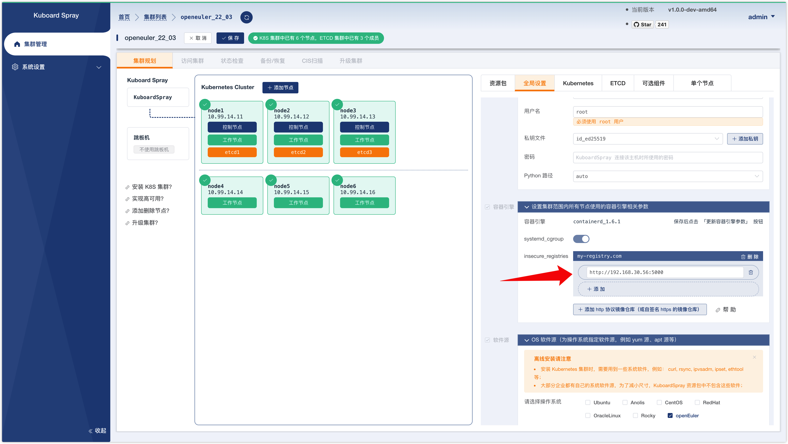
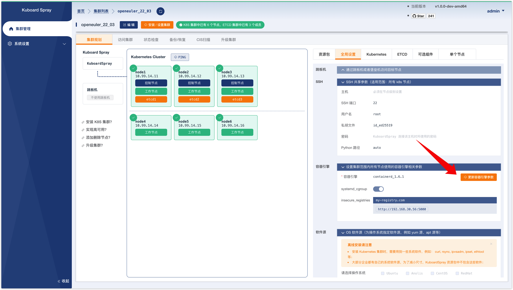
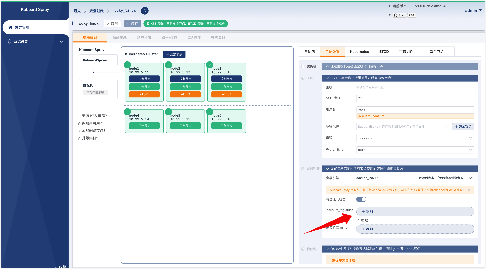
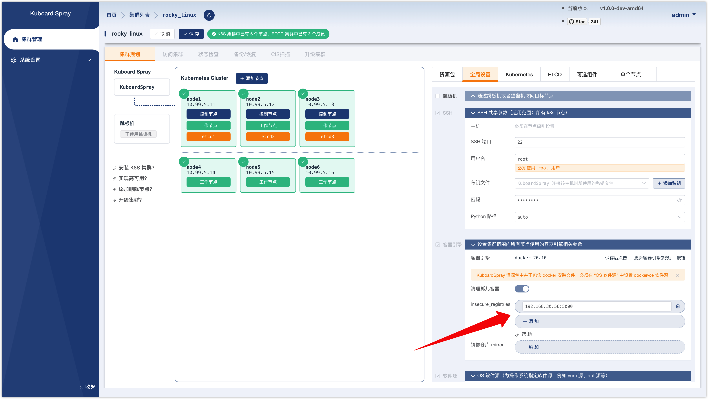
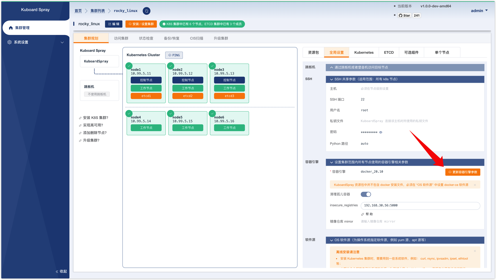

# Insecure-Registry

> kuboard-spray 的版本不低于 `v1.0.1`。

您可能自己搭建了一个镜像仓库服务用于测试或者其他目的，由于某些限制，您不能为您的镜像仓库配置有效的 https 证书，因此，您的镜像仓库可能是如下两种情况当中的一种：
* 镜像仓库通过 http 协议提供服务；
* 镜像仓库通过 https 协议提供服务，但是 https 证书是一个自签名证书。

这种情况下，该镜像仓库被称为 `insecure-registry`。您需要在每一个 K8S 节点的容器引擎中做对应的设置，以使得容器引擎可以正常从您搭建的 `insecure-registry` 镜像仓库中拉取镜像。

当您使用 kuboard-spray 安装集群的时候，您只需要在界面上做简单操作即可完成对所有 K8S 节点上的容器引擎的参数配置。本文针对 docker 引擎和 containerd 引擎分别介绍了如何在 `kuboard-spray` 中设置 `insecure-registry`。

## containerd

**假设：**
* 假设您安装集群时，选择了 `containerd` 作为容器引擎；
* 假设您的镜像仓库 IP 地址及端口为 `192.168.30.56:5000`，该镜像仓库服务为 insecure-registry（使用 http 协议提供服务，或者使用 https 协议但是配置了自签名证书）；
* 假设该镜像仓库中，有一个镜像 `registry-name/image-name:tag`；
* 假设您使用 `my-registry.com` 代表该镜像仓库，则您使用这个格式引用该镜像 `my-registry.com/registry-name/image-name:tag`；

执行如下步骤，可以配置所有 K8S 节点的 containerd 容器引擎，以正常从该 `insecure-registry` 中拉取镜像。

> * 使用您自己的镜像仓库的 IP地址及端口替换 `192.168.30.56:5000`；
> * 使用您自己的域名替换 `my-registry.com`，如果仅在 K8S 中使用该域名，无需为其配置 DNS 解析；
> * 使用您自己的镜像替换 `registry-name/image-name:tag`。

* 在 kuboard-spray 中打开集群的详情页，并进入编辑模式，切换到 `全局设置` 标签页，如下图所示：
  
  

* 点击上图中的 `添加 http 协议镜像仓库（或自签名 https 的镜像仓库）` 按钮，并在弹出的输入框中填写 `my-registry.com`，如下图所示：

  

* 点击上图中的 `确定` 按钮后，在 `my-registry.com` 对应的输入框中填写 `http://192.168.30.56:5000` 如下图所示：

  > 如果您的镜像仓库配置了自签名证书，请填写 `https://192.168.30.56:5000`

  

* 点击页面上方的 `保存` 按钮，结果如下图所示：

  

* 点击上图中的 `更新容器引擎参数` 按钮，然后点击弹出菜单中的 `确定` 按钮，kuboard-spray 将对每一个 k8s 节点执行配置操作
* 在完成上一部后，进入任意一个 K8S 节点的命令行终端界面，并执行如下命令，如果能够正常抓取到镜像，则证明参数配置已生效
  ```sh
  # 请使用您自己的参数替换 my-registry.com/registry-name/image-name:tag
  crictl pull my-registry.com/registry-name/image-name:tag
  ```

## docker

**假设：**
* 假设您安装集群时，选择了 `docker` 作为容器引擎；
* 假设您的镜像仓库 IP 地址及端口为 `192.168.30.56:5000`，该镜像仓库服务为 insecure-registry（使用 http 协议提供服务，或者使用 https 协议但是配置了自签名证书）；
* 假设该镜像仓库中，有一个镜像 `registry-name/image-name:tag`；
* 假设您使用这个格式引用该镜像 `192.168.30.56:5000/registry-name/image-name:tag`；

执行如下步骤，可以配置所有 K8S 节点的 docker 容器引擎，以正常从该 `insecure-registry` 中拉取镜像。

> * 使用您自己的镜像仓库的 IP地址及端口替换 `192.168.30.56:5000`；
> * 使用您域名替换 `192.168.30.56:5000`，则需要为其配置 DNS 解析；
> * 使用您自己的镜像替换 `registry-name/image-name:tag`。

* 在 kuboard-spray 中打开集群的详情页，并进入编辑模式，切换到 `全局设置` 标签页，如下图所示：
  
  

* 在上图中，点击 `insecure_registries` 对应的 `添加` 按钮，并在输入框中填写 `192.168.30.56:5000`，如下图所示：

  

* 点击页面上方的 `保存` 按钮，结果如下图所示：

  

* 点击上图中的 `更新容器引擎参数` 按钮，然后点击弹出菜单中的 `确定` 按钮，kuboard-spray 将对每一个 k8s 节点执行配置操作
* 在完成上一部后，进入任意一个 K8S 节点的命令行终端界面，并执行如下命令，如果能够正常抓取到镜像，则证明参数配置已生效
  ```sh
  # 请使用您自己的参数替换 192.168.30.56:5000/registry-name/image-name:tag
  docker pull 192.168.30.56:5000/registry-name/image-name:tag
  ```