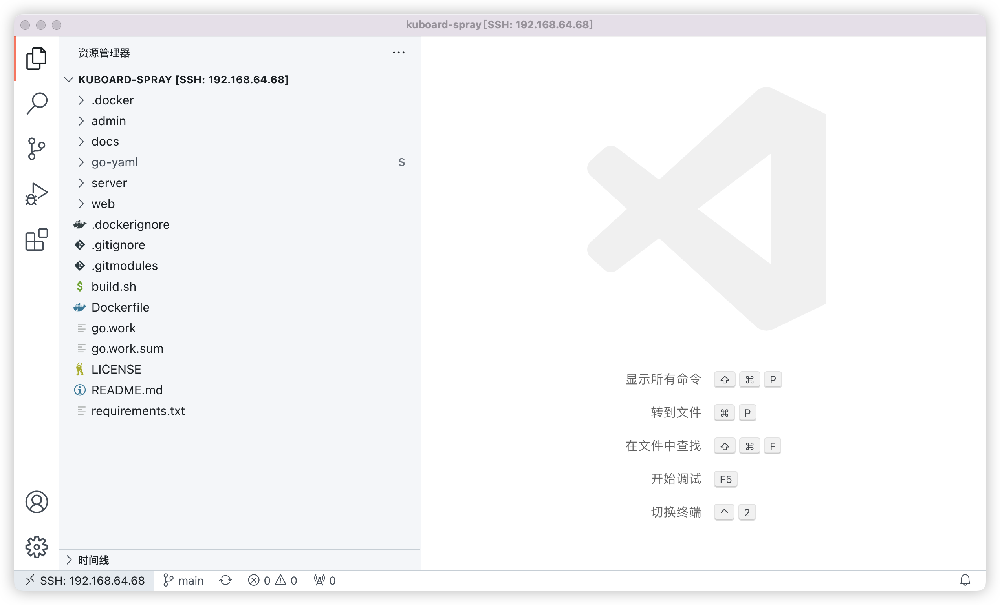
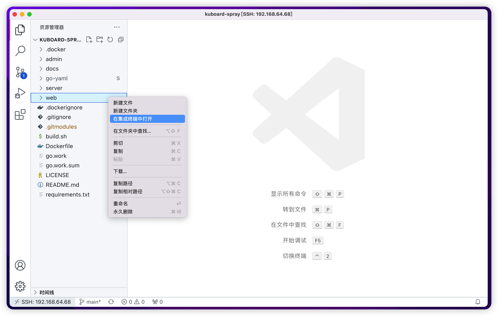

# 配置开发测试环境

本文描述了如何配置 KuboardSpray 的开发测试环境，并编译和构建 KuboardSpray。本文的目标读者为想要尝试对 KuboardSpray 进行二次开发的开发者。

## 开发环境要求

建议使用 Linux 或者 MacOS 操作系统，推荐 Ubuntu 20.04，如果使用 windows 作为开发环境，大概率会出现文件路径过长导致 windows 不支持的情况。

开发环境的配置要求不应低于：
* CPU 4核
* 内存 8G
* 磁盘空间 60G，因为经常构建镜像，推荐磁盘空间不小于 120G

开发环境所需要的软件列表如下：

* Docker 20.10.17 或更高版本
  * https://docs.docker.com/engine/install/ubuntu/#install-using-the-convenience-script
    ```sh
    curl -fsSL https://get.docker.com -o get-docker.sh
    sh ./get-docker.sh
    # 检查安装是否成功
    docker version
    ```
* go1.18
  * https://go.dev/doc/install
  * 下载
    ```sh
    # 可能需要翻墙或者找国内下载的站点
    wget https://go.dev/dl/go1.18.4.linux-arm64.tar.gz
    #或者
    wget https://go.dev/dl/go1.18.4.linux-amd64.tar.gz
    ```
  * 安装
    ```sh
    # 1. 删除已有 golang，并安装新的 go lang
    rm -rf /usr/local/go && tar -C /usr/local -xzf go1.18.4.linux-amd64.tar.gz
    # 2. 将如下三行 export 指令添加到 /etc/profile 文件的末尾
    export PATH=$PATH:/usr/local/go/bin
    export GO111MODULE=on
    export GOPROXY=https://goproxy.cn
    # 3. 打开一个新的终端界面，执行 go version，查看已安装版本
    go version
    go env | grep GOPROXY
    ```
* node v14.16.1 或更高版本
  * 下载 https://nodejs.org/en/download/
    ```sh
    wget https://nodejs.org/dist/v16.16.0/node-v16.16.0-linux-x64.tar.xz
    或
    wget https://nodejs.org/dist/v16.16.0/node-v16.16.0-linux-arm64.tar.xz
    ```
  * 安装 https://github.com/nodejs/help/wiki/Installation
    ```sh
    # 安装
    VERSION=v16.16.0
    DISTRO=linux-x64
    sudo mkdir -p /usr/local/lib/nodejs
    sudo tar -xJvf node-$VERSION-$DISTRO.tar.xz -C /usr/local/lib/nodejs 

    # 将如下三行添加到 ~/.profile 或者 /etc/profile 的末尾
    VERSION=v16.16.0
    DISTRO=linux-x64
    export PATH=/usr/local/lib/nodejs/node-$VERSION-$DISTRO/bin:$PATH

    # 打开新的终端窗口并检查安装结果
    node -v
    npm version
    npx -v
    ```

* npm 6.14.12 或更高版本
  * 在上一个步骤中安装 node 时，会同时完成 npm 的安装
* yarn v1.22.17 或更高版本
  https://classic.yarnpkg.com/lang/en/docs
  ```sh
  npm install --global yarn
  yarn --version
  ```
* 设置 npm/yarn 国内镜像
  https://www.npmjs.com/package/yrm
  ```sh
  npm install -g yrm
  yrm ls
  yrm use taobao
  ```

* 安装 pip
  ```sh
  sudo apt update
  sudo apt install -y python3-pip
  sudo pip3 --version
  ```

* 安装 sshpass
  ```sh
  apt install -y sshpass
  ```

## 进入开发环境

建议使用 vscode 作为 IDE 环境。

### vscode 插件建议

* Auto Close Tag
* Auto Rename Tag
* Remote - Containers
* Remote - SSH
* Remote - SSH:Editing Configuration Files
* Docker
* npm Intellisense
* Vetur
* Go
* IntelliCode
* IntelliSense for CSS class names in HTML

### 导入代码到开发环境

* 执行如下命令，将代码 clone 到开发环境。

  ```sh
  git clone https://github.com/eip-work/kuboard-spray.git
  cd kuboard-spray
  git submodule update --init
  ```

* 使用 vscode 打开 kuboard-spray 目录，如下图所示：

  

* 在 vscode 中导航到 `kuboard-spray/requirements`，点击右键，并点击 `在集成终端中打开`，如下图所示

  ```sh
  # 当前路径为 kuboard-spray
  sudo pip install -r requirements.txt
  ```

* 替换对 `ansible` 定制的文件：

  ```sh
  cp .docker/ansible-patch/config/base.yml /usr/local/lib/python3.8/dist-packages/ansible/config/base.yml
  cp .docker/ansible-patch/plugins_callback/default.py /usr/local/lib/python3.8/dist-packages/ansible/plugins/callback/default.py
  cp .docker/ansible-patch/plugins_callback/__init__.py /usr/local/lib/python3.8/dist-packages/ansible/plugins/callback/__init__.py
  cp .docker/ansible-patch/plugins_action/raw.py /usr/local/lib/python3.8/dist-packages/ansible/plugins/action/raw.py
  ```


## 运行开发环境

需按如下步骤逐个运行各组件

* 运行 kuboard-spray server
* 运行 kuboard-spray web

### 运行 kuboard-spray server

* 在 vscode 中导航到 `kuboard-spray/web`，点击右键，并点击 `在集成终端中打开`，如下图所示

  

* 在集成终端中（kuboard/web 路径下）执行命令：

  ```sh
  ln -s version-amd64.json public/version.json  # 如果您使用 arm64 CPU，请替换 version-amd64.json 为 version-arm64.json
  yarn install
  yarn build
  ```

* 在 vscode 中导航到 `kuboard-spray`，点击右键，并点击 `在集成终端中打开`，省略截图；

* 在集成终端中（kuboard-spray 路径下）执行命令：

  ```sh
  mkdir -p data/user
  ```

* 在 vscode 中导航到 `kuboard-spray/server`，点击右键，并点击 `在集成终端中打开`，省略截图；

* 在集成终端中（kuboard-spray/server 路径下）执行命令：

  ```sh
  go run kuboard-spray.go
  ```

  如果执行成功，最后的输出日志如下所示：
  ```sh
  # 如果是 amd64 环境
  [GIN-debug] Listening and serving HTTP on :8006
  # 如果是 arm64 环境
  [GIN-debug] Listening and serving HTTP on :8007
  ```


### 运行 kuboard-spray web

* 在 vscode 中导航到 `kuboard-spray/web`，点击右键，并点击 `在集成终端中打开`，省略截图；

* 编辑 `/etc/hosts` 文件，添加如下信息：

  ```sh
  192.168.64.68  kb kuboard-spray-arm
  # 假设 192.168.64.68 为您开发环境的 IP 地址
  ```

* 在集成终端中（kuboard-spray/web 路径下）执行命令：

  ```sh
  ln -s public/version-amd64.json version.json
  # 如果是 arm64 CPU，请执行如下命令
  # ln -s public/version-arm64.json version.json
  ```

* 在集成终端中（kuboard-spray/web 路径下）执行命令：

  ```sh
  yarn serve
  ```

* 在浏览器打开如下路径

  `http://kb:25702`（如果是 amd64 CPU）
  或 `http://kuboard-spray-arm:25703` （如果是 arm64 CPU）。

* 在登录界面中输入默认用户名 `admin`，默认密码 `Kuboard123`，可登录到 KuboardSpray 的界面。

## 构建容器镜像

构建容器镜像时，只需要在开发环境的 `kuboard-spray` 目录中执行如下命令

```sh
./build.sh v1.2.0 no_push
# 其中 v1.2.0 为本次构建时的版本号，no_push 参数代表只生成镜像，不推送到镜像仓库
```